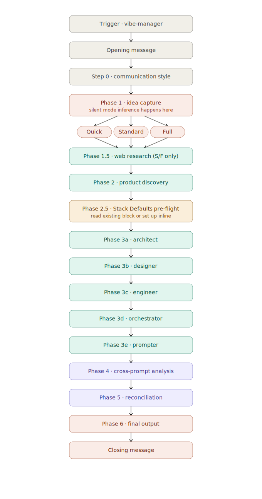
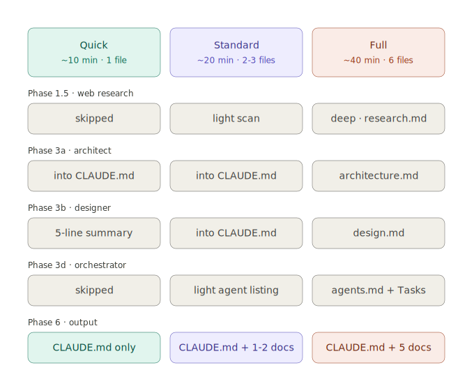
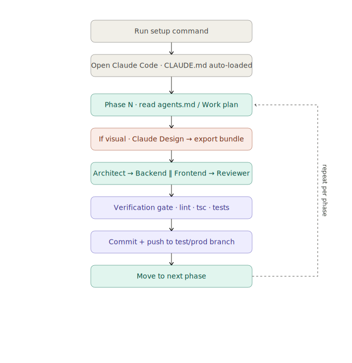

# vibe-manager

A Claude skill that turns a one-line project idea into a complete, executable plan for [Claude Code](https://docs.claude.com/en/docs/claude-code) and [Claude Design](https://claude.ai/design).

## What it does

You start with a project idea. vibe-manager runs a sequence of embedded specialists — researcher, architect, designer, engineer, agent orchestrator, and design prompter — and produces:

- **`CLAUDE.md`** at your repo root: project brief + engineering conventions, read by Claude Code on every session
- **`docs/`**: 1–5 deep specification files (research, architecture, design, agents, design prompts) depending on project scope
- **A setup command** to scaffold the repo
- **A clear "next steps" guide** telling you exactly which prompts to paste into Claude Code vs Claude Design

Three modes — **Quick / Standard / Full** — automatically inferred from how you describe the project. Small experiment? Quick mode produces 1 file in ~10 minutes. Production product with paying customers? Full mode produces 6 files in ~40 minutes.

## Why use it

If you've used Claude Code, you know the pattern: every new project starts with the same dance — re-explaining your stack, your conventions, your CI flow, your folder structure. Then you spend the first session arguing about library choices instead of building.

vibe-manager front-loads all of that into one structured conversation. The output is a project that Claude Code can execute against without re-asking questions, plus a separate set of prompts you paste into Claude Design when you need visuals.

It also adapts depth to project scope. A weekend prototype doesn't need a 6-file architecture spec, but a long-term product with 8+ features and multiple agents very much does. The skill figures out which is which from your framing.

## Installation

### Claude Code (terminal)

```bash
mkdir -p ~/.claude/skills/vibe-manager
cp vibe-manager.md ~/.claude/skills/vibe-manager/
```

If skill discovery doesn't pick it up, create a symlink:

```bash
cd ~/.claude/skills/vibe-manager && ln -s vibe-manager.md SKILL.md
```

### Claude Desktop

Same paths — `~/.claude/skills/vibe-manager/vibe-manager.md`. Restart Claude Desktop fully (quit from system tray / Activity Monitor, not just close window).

### claude.ai

Skills aren't supported in claude.ai web at the time of writing. Use Claude Code or Claude Desktop.

## Usage

In a fresh Claude conversation, type any of these triggers:

- `vibe-manager`
- `start vibe-manager with a new project`
- `comprehensive project plan`
- `from idea to prototype with full plan`

The skill works in any language — if you write in Turkish, German, Spanish, etc., the skill responds in your language.

What happens next:

1. **Communication style ask** (5 seconds): minimal / balanced / detailed
2. **Idea capture**: describe your project in 1–2 sentences. Manager silently picks a mode (Quick / Standard / Full) from your framing — no question asked.
3. **(Optional) Web research**: in Standard or Full mode, manager scans for competitors, market gaps, proven patterns.
4. **Product discovery**: features + acceptance criteria + enhancement loop
5. **Stack Defaults check**: now that the project is scoped, vibe-manager looks for a `## Stack Defaults` block in your `~/.claude/CLAUDE.md`. If missing, it walks you through setting one up inline (one-time, ~10 minutes, reused across all your future projects).
6. **Specialist sequence**: architecture → design → engineering → agents → design prompts
7. **Cross-prompt analysis + reconciliation**
8. **Final output**: files + setup command + "what to do next" guide

Total time: ~10 min (Quick) to ~40 min (Full).



## Modes

vibe-manager silently picks one of three modes based on how you describe your project. You can also explicitly request a mode by saying so in your trigger.

| Mode | Best for | Output | Time |
|------|----------|--------|------|
| **Quick** | Experiments, prototypes, weekend projects, viral mini-apps | 1 file (CLAUDE.md) | ~10 min |
| **Standard** | MVPs heading to public launch, side projects with growth potential | 2-3 files (CLAUDE.md + docs/research.md + optional docs/design-prompts.md) | ~20 min |
| **Full** | Production products, paying customers, complex domains, multi-agent execution | 6 files (CLAUDE.md + 5 docs/) | ~40 min |

You can override mid-flow at any time: "let's make this bigger" upgrades, "this is overkill" downgrades.



## What you do with the output

After vibe-manager finishes, it tells you exactly what to do next. The short version per mode:

**Quick mode:**
1. Run the setup command
2. Open Claude Code, type "Start Phase 1 from CLAUDE.md"
3. Single-session, no sub-agents

**Standard mode:**
1. Run the setup command
2. Open Claude Code, type "Start Phase 1 per CLAUDE.md's Work plan, organize using the agent roster — manual orchestration"
3. (If UI deliverables) Paste design-prompts.md prompts into [claude.ai/design](https://claude.ai/design)

**Full mode:**
1. Run the setup command
2. Open Claude Code as orchestrator, type "Read docs/agents.md and start Phase 1"
3. Each phase may have a Step 0 visual production: paste the matching prompt from design-prompts.md into Claude Design, export the bundle, hand it back to Claude Code
4. Phase verification gate → commit → next phase



## Stack Defaults — what they are

Stack Defaults is a block in `~/.claude/CLAUDE.md` that holds your persistent technical preferences:

```
## Stack Defaults
Core: Language=TypeScript, Framework=Next.js (App Router), Styling=Tailwind + shadcn/ui
Data: Database=Postgres, ORM=Drizzle, File storage=S3-compatible
Auth: Better Auth (email + magic link)
Email: Resend
LLM: OpenRouter (Claude Sonnet for structured tasks)
Hosting: <your hosting>
DNS: Cloudflare
Error tracking: Sentry
CI: GitHub Actions
Git workflow: trunk-based, dev branch → test deploy, main branch → prod deploy
Commit convention: Conventional Commits
Working pattern: hybrid (single-session for small, multi-agent for complex)
Verification gates: pragmatic (lint + tsc + smoke test)
Domain pattern: <optional — flagship vs experiment subdomain>
Explanation level: balanced
```

This block is created **once** and reused across all your projects. vibe-manager reads it and never re-asks framework / DB / CI / git workflow / etc. per project.

If you don't have one, vibe-manager walks you through setup inline on first use. Takes ~10 minutes. After that, every future project is faster.

## Requirements

- **Claude Code** or **Claude Desktop** (claude.ai web doesn't support skills yet)
- A `~/.claude/CLAUDE.md` file (vibe-manager creates the Stack Defaults block on first use if missing)
- Optionally: [Claude Code](https://docs.claude.com/en/docs/claude-code) installed for the actual code execution phase
- Optionally: [Claude Design](https://claude.ai/design) access for visual deliverables

## Troubleshooting

**Trigger not firing**: Make sure `~/.claude/skills/vibe-manager/vibe-manager.md` exists. If still not picked up, create a `SKILL.md` symlink in the same folder. Fully restart Claude Code or Claude Desktop after installation.

**"Where's stack-profiler?"**: vibe-manager has its own inline Stack Defaults walkthrough — no separate skill needed. The phrase "stack-profiler" appears in the docs as the historical name; treat references as descriptive, not as a dependency.

**Files not appearing in /mnt/user-data/outputs**: vibe-manager produces inline code blocks unless `create_file` tools are available. In Claude Desktop, enable file creation in settings, or just copy the code blocks manually.

**Mode picked wrong**: Just say "switch to Quick" or "let's go Full" mid-flow. Manager re-routes accordingly. If a specialist already ran, its output is condensed into the smaller mode's structure or expanded for the larger mode.

## Project structure

```
vibe-manager/
├── README.md           # this file
├── LICENSE             # MIT
├── vibe-manager.md     # the skill itself (single self-contained file)
└── diagrams/           # workflow SVGs embedded above
```

The skill is one file. All 6 specialists are embedded inline as `## Embedded Specialist:` sections.

## Contributing

Issues and PRs welcome. The skill file is large (~4100 lines) but structured into clear phases. To propose changes:

1. Open an issue describing what's not working or what could be better
2. For code changes, branch off main, modify `vibe-manager.md`, test against a real project setup
3. Keep specialist sections internally consistent — if you change architect output format, also update the cross-prompt analysis (Phase 4) checks that reference it

## License

MIT — see [LICENSE](LICENSE).

## Credits

Built iteratively through real project use. Inspired by the patterns that emerge when you run dozens of projects through Claude Code and notice the same setup friction every time. The 5 specialists, mode adaptation, and Claude Design ↔ Claude Code handoff all came from concrete pain points — not from designing a system in the abstract.
